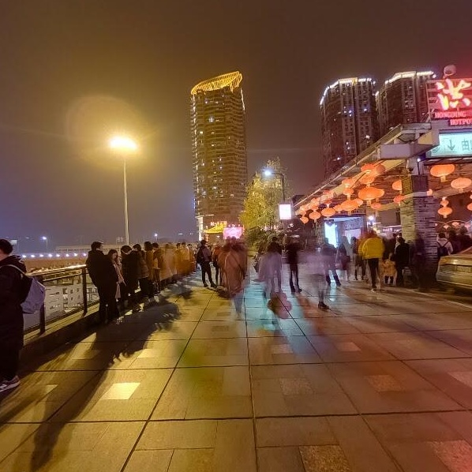
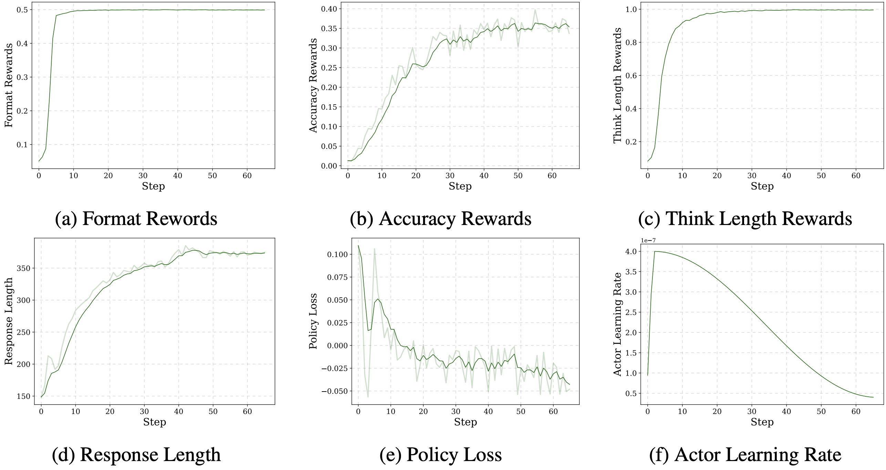

<div align="center">

<div align="center">
    
</div>

<h1>SeekWorld: Geolocation is a Natural RL Task for o3-like Visual Clue-Tracking Reasoning</h1>

<div align="center">
  <!-- <a href="xxx"></a> &ensp; -->
  <a href="https://huggingface.co/datasets/TheEighthDay/SeekWorld"></a> &ensp;
  <a href="https://huggingface.co/TheEighthDay/SeekWorld_RL_PLUS"></a> &ensp;
  <a href="https://huggingface.co/spaces/TheEighthDay/SeekWorld_APP"></a> &ensp;
</div>

</div>

<hr>

[Switch to the Chinese version (切换至中文版)](/README_zh.md)

## News

- [2025/4/20] ✨  **The first attempt to replicate o3-like visual clue-tracking reasoning capabilities!** We have open-sourced the **SeekWorld** dataset and the directly RL-trained model **SeekWorld-7B**!

## 👀 About SeekWorld

To enhance the performance of multimodal large language models (MLLMs), recent methods have tried to stimulate pure reasoning abilities through image-based mathematical problems, chart analysis, and logical puzzles. Others focus on enhancing low-level perceptual abilities through traditional detection tasks (e.g., object detection, counting, and segmentation). Additionally, some works aim to achieve visual content re-perception in text form as part of the reasoning process. However, a key limitation is that **MLLMs still rely solely on text when performing visual reasoning**.

OpenAI's **[ChatGPT-o3](https://openai.com/index/thinking-with-images/)** enables visual reasoning within a chain-of-thought, allowing for dynamic image manipulation (e.g., rotation, zooming, or transformation) during the reasoning process. This is exemplified by the phrase, "but I’ll zoom in a bit just to be absolutely sure!" which significantly boosts perceptual capabilities, enabling the model to uncover subtle, ambiguous, or easily overlooked visual clues and form a comprehensive visual reasoning evidence chain. One particularly interesting example from the official documentation demonstrates how an image can be used to infer the filming location of a movie. In such scenarios, visual clues are extracted and inferred iteratively—extract visual clues, reason, extract visual clues, reason—until a final conclusion is reached. We believe the term "Visual Clue-Tracking" aptly captures this capability.


We introduce a novel task named ***Geolocation Reasoning***. This task requires the model to reason through high-level logical relationships within the visual semantics while perceiving visual information, ultimately determining the correct location, making it a perfect candidate for o3-like visual clue-tracking reasoning. You can gain a deeper understanding of this task through these "guess where the photo was taken" games: [GeoGuess](https://www.geoguessr.com/) and [TuXun](https://tuxun.fun/). We have built a rule-based reinforcement learning dataset for geolocation: **[SeekWorld](https://huggingface.co/datasets/TheEighthDay/SeekWorld)**. The dataset includes two training sets: one (**Train-Clue-Tracking**) contains **50(with ongoing expansion) detailed examples of visual clue-tracking reasoning processes** collected from o3, while the other (**Train-No-Process**) contains **8541 data points without visual clue-tracking reasoning**. The former is used for **Cold-Start SFT** training, and the latter is used for **RL** training. Additionally, there are two test sets for comprehensive evaluation.

We have trained a model based on Train-No-Process using RL with Qwen2.5-7B-VL-Instruct: **[SeekWorld-7B](https://huggingface.co/TheEighthDay/SeekWorld_RL_PLUS)**.

## 🌟 Future Work

- [ ] **Further expand the size of the Cold-Start SFT Train-Clue-Tracking dataset**
- [ ] **Cold-Start SFT (Train-Clue-Tracking) + RL (Train-No-Process)**: The Cold-Start SFT training has not yet been completed, and we aim to replicate o3-like visual clue-tracking abilities.
- [ ] **Evaluating o3's performance on SeekWorld**: Due to API restrictions, we have not yet been able to evaluate o3's performance on SeekWorld.
- [ ] **Evaluating performance on other perceptual and reasoning benchmarks**: We will assess how the o3-like model trained on geolocation reasoning performs across other domains.

## 🔍 Dataset

* **Visual clue-tracking Process**: The first dataset containing o3 model's visual reasoning chains or visual clue tracking capabilities.
* **Global Diverse Sampling**: Includes a wide variety of scenes from across the world, ensuring that the model can generalize well to different cultures, terrains, and environmental contexts.
* **Image-Label Pairs Optimized for Rule-Based RL**: The dataset cleans images from location watermarks, and provides additional aliases for the geographic coordinates' administrative divisions to prevent model misinterpretation.
* **Hierarchical Difficulty Architecture**: Contains three levels of reasoning difficulty—easy, medium, and hard—designed to gradually challenge and assess the model's geolocation ability.

<table>
  <thead>
    <tr>
      <th>Dataset</th>
      <th>Data Volume</th>
      <th>Source</th>
    </tr>
  </thead>
  <tbody>
     <tr>
      <td>Train-Clue-Tracking</td>
      <td>50(with ongoing expansion)</td>
      <td>Collection of visual clue-tracking reasoning process from o3</td>
    </tr>
    <tr>
      <td>Train-No-Process <br>(easy-medium-hard)</td>
      <td>8541  <br>(1945-941-5655)</td>
      <td>Panoramas & user-uploaded images from Google Maps in recent years</td>
    </tr>
    <tr>
      <td>Global-Test</td>
      <td>320</td>
      <td>Panoramas & user-uploaded images from Google Maps in recent years</td>
    </tr>
    <tr>
      <td>China-Test</td>
      <td>373</td>
      <td>The latest Xiaohongshu App images collected on April 14, 2025, and it is almost impossible to have been pre-trained</td>
    </tr>
  </tbody>
</table>

Google Driver: [SeekWorld](https://drive.google.com/drive/folders/115X73SRULCYLKZqd3UHs4MIG3PI4BSkw?usp=sharing). For more details about the dataset, refer to [DATASET.md](DATASET.md).


## 🏆 Performance
<table>
    <thead>
        <tr>
            <th>Model</th>
            <th>Global-Test</th>
            <th>China-Test</th>
            <th>Overall Accuracy</th>
        </tr>
    </thead>
    <tbody>
        <!-- 第一组标题 -->
        <tr>
            <td colspan="4" style="text-align:center; font-style:italic;"><em>Bigger model</em></td>
        </tr>
        <tr>
            <td><a href="https://openai.com/index/gpt-4o-system-card/">GPT4o-240806</a>🔒</td>
            <td><b>56.50</b></td>
            <td>31.90</td>
            <td><b>43.26</b></td>
        </tr>
        <tr>
            <td><a href="https://team.doubao.com/zh/special/doubao_1_5_pro">Doubao-1.5-vision-pro-32k-250115</a>🔒</td>
            <td>43.75</td>
            <td><b>40.48</b></td>
            <td>41.99</td>
        </tr>
        <tr>
            <td><a href="https://deepmind.google/technologies/gemini/flash-thinking/">Gemini-2.0-flash-thinking-exp-01-21</a>🔒🧠</td>
            <td>56.25</td>
            <td>29.49</td>
            <td>41.85</td>
        </tr>
        <tr>
            <td><a href="https://huggingface.co/Qwen/QVQ-72B-Preview">QvQ-72B-max-2025-03-25</a>🧠</td>
            <td>48.13</td>
            <td>31.63</td>
            <td>39.25</td>
        </tr>
        <tr>
            <td><a href="https://github.com/QwenLM/Qwen2.5-VL">Qwen-2.5-32B-VL</a></td>
            <td>38.12</td>
            <td>24.13</td>
            <td>30.59</td>
        </tr>
        <!-- 第二组标题 -->
        <tr>
            <td colspan="4" style="text-align:center; font-style:italic;"><em>Small model (7B)</em></td>
        </tr>
        <tr>
            <td> <b><a href="https://huggingface.co/TheEighthDay/SeekWorld_RL_PLUS">SeekWorld-7B</a></b> [Cold-Start SFT + RL] <i>(ours)</i></td>
            <td><b>-</b></td>
            <td><b>-</b></td>
            <td><b>-</b></td>
        </tr>
        <tr>
            <td> <b><a href="https://huggingface.co/TheEighthDay/SeekWorld_RL_PLUS">SeekWorld-7B</a></b> [Direct RL] <i>(ours)</i></td>
            <td><b>59.69</b></td>
            <td><b>34.65</b></td>
            <td><b>46.21</b></td>
        </tr>
        <tr>
            <td><a href="https://github.com/QwenLM/Qwen2.5-VL">Qwen-2.5-7B-VL</a> [Direct RL] </td>
            <td>51.25</td>
            <td>31.90</td>
            <td>40.84</td>
        </tr>
        <tr>
            <td><a href="https://github.com/QwenLM/Qwen2.5-VL">Qwen-2.5-7B-VL</a> [Direct SFT] </td>
            <td>37.19</td>
            <td>25.47</td>
            <td>30.88</td>
        </tr>
        <tr>
            <td><a href="https://github.com/QwenLM/Qwen2.5-VL">Qwen-2.5-7B-VL</a></td>
            <td>33.44</td>
            <td>24.40</td>
            <td>28.57</td>
        </tr>
        <tr>
            <td><a href="https://github.com/QwenLM/Qwen2.5-VL">Qwen-2.5-7B-VL</a> + <a href="https://arxiv.org/pdf/2502.13759">CoT</a></td>
            <td>25.31</td>
            <td>21.45</td>
            <td>23.23</td>
        </tr>
    </tbody>
</table>

Models marked with 🔒 are **proprietary closed-source models**, and those marked with 🧠 have **enhanced reasoning capabilities**. We use the (<a href="https://arxiv.org/pdf/2501.03262">Reinforce++</a>) RL algorithm.

Currently, we have not completed Cold-Start SFT training on Train-Clue-Tracking. Direct SFT and Direct RL refer to SFT and RL training directly on Train-No-Process, respectively. Compared to Qwen-2.5-7B-VL, SeekWorld-7B attempted two optimizations during RL training, with difficulty sampling significantly improving test accuracy. Length incentives only increased the reasoning process length but did not enhance accuracy. However, it better demonstrated the intermediate reasoning process. We are also experimenting with GRM ([code for geolocation reasoning](./src/lmm-r1/openrlhf/models/remote_rm/location_verifier_process.py)).

* **Difficulty Sampling**: We sampled questions of varying difficulty levels in the training set. Specifically, due to the relatively large number of hard questions (5655), we doubled the number of easy (1945) and medium difficulty (941) questions, expanding them to 3890 and 1882, respectively.

* **Length Incentives**: We introduced a reward mechanism to encourage increased reasoning length. The reward value is set as the character count multiplied by 0.001, with a maximum reward of 1.0.

## 🖥️ Demo
Let's test a picture and experience the power of geolocation reasoning from o3 model:

Can you identify this location?



The process of visual clue-tracking and its results are recorded in [o3_demo.md](/o3_demo.md).


Let’s take a look at the effect of our SeekWorld-7B:
```bash
CUDA_VISIBLE_DEVICES=0 python simple_inference.py --image_path test.jpg --model_name TheEighthDay/SeekWorld_RL_PLUS --inference_engine transformers
```


```text
<think>
The image depicts a traditional Chinese street scene with wooden buildings, red lanterns, and Chinese characters on the walls. The architecture and the style of the buildings, along with the presence of traditional Chinese elements such as the lanterns and the writing, suggest that this is a scene from a Chinese village or town. The design and the layout of the buildings are characteristic of ancient Chinese towns, which often have a historical significance and are known for their preserved traditional architecture.
The presence of Chinese characters and the style of the buildings suggest that this is likely in China, specifically in an area where such traditional architecture is common. The style of the buildings and the overall atmosphere could be indicative of a place like Lijiang, which is famous for its well-preserved old town and is located in Yunnan Province, a province known for its diverse cultural heritage and historical sites.
Given the architectural style and the cultural elements, it is reasonable to infer that this image is from a region in China that has a rich history and traditional architecture. The specific style of the buildings and the presence of traditional Chinese elements suggest that this could be a part of Yunnan Province, which is known for its ancient towns and villages that have been preserved over time.
Therefore, based on the architectural style and the cultural elements, it is reasonable to conclude that this image was taken in China, specifically in Yunnan Province, which is one of the first-level administrative regions of China.
</think>
<answer>
$China, Yunnan$
</answer>
```

This is indeed the ancient town of Shaxi in Yunnan, and the model provided a detailed reasoning process, locating it in Yunnan!

You can try on our [Online Demo](https://huggingface.co/spaces/TheEighthDay/SeekWorld_APP)~

## 🔥 Training
Please refer to [LMM-R1](./src/lmm-r1) for setting up the training environment. 
```bash
cd src/lmm-r1/
bash examples/scripts/lmm_r1/train_direct_rl_seekworld.sh
```

## 📈 Direct RL Training Curves



## 🤝 Acknowledgements

We would like to express our sincere thanks to [lmm-r1](https://github.com/TideDra/lmm-r1) and [OpenRLHF](https://github.com/OpenRLHF/OpenRLHF) for providing the excellent baseline code!

## ✏️ Citations

If you find our work helpful in your research, please consider citing us:
```bibtex
@misc{seekworld2025,
  title = {{S}eek{W}orld: Geolocation is a Natural {RL} Task for o3-like Visual Clue-Tracking},
  author = {Tian, Kaibin and Xin, Zijie and Liu, Jiazhen},
  year = {2025},
  howpublished = {\url{https://github.com/xxayt/SeekWorld_private}},
  note = {GitHub repository}
}
```

## 📮 Contribute via Crowdsourcing
We warmly welcome you to contribute to the SeekWorld project! If you are interested in geolocation reasoning, you can send us a challenging test image to help us build a more comprehensive evaluation dataset. Here’s how you can contribute:

* Take a photo with geographic clues that is not easy to immediately recognize the location (e.g., street views, lifestyle photos, architecture, natural landscapes).
* Ensure the photo corresponds to a real location (e.g., specific country and first-level administrative region). If possible, please also provide the latitude and longitude of the location. Ensure the image does not contain any personal information.
* Please include "[SeekWorld Crowd Contribution]" in the email subject. Then, send the image to our email address: **tikibi001@163.com**.

## 📬 Contact 
Kaibin Tian: 1109419614@qq.com

Feel free to contact us on WeChat:


