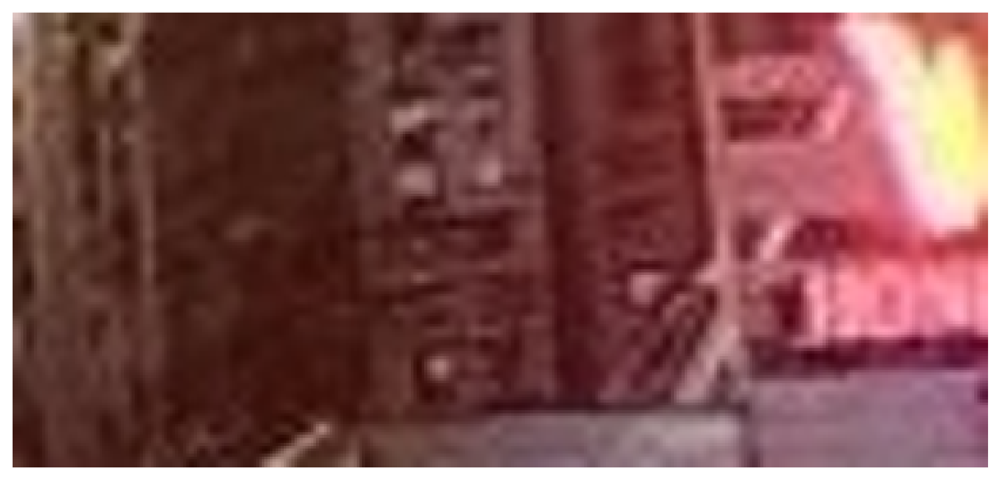
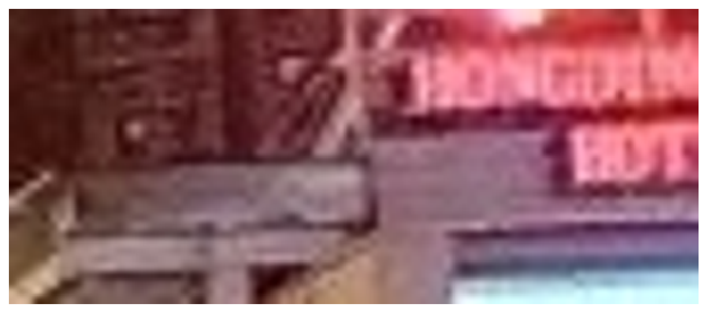

\<think\>

 
[coordinates: 0.0000, 0.0000, 0.9990, 0.9990]

Well, I'll think about it. Maybe I need to zoom in on the logo in the upper right corner to see if I can clearly see Chinese characters or other information. I'm going to crop this area so that I can better read the information. This should help me better understand and answer the user's questions.

 
[coordinates: 0.6985, 0.0000, 0.9990, 0.2992]

There are some Chinese art fonts on this logo. I can crop the bottom part so that I can more clearly see the remaining part. This can help me better understand the information on the logo and ensure that I don't miss any details.

 
[coordinates: 0.6987, 0.2422, 0.9990, 0.5483]

Well, if I crop now, I might miss part of the text. To ensure that I can see the complete information, I'm considering adjusting the crop position to ensure that the top logo area is included. This can better capture all the details and avoid missing any content that needs to be viewed.

 
[coordinates: 0.6172, 0.0930, 0.9080, 0.4010]

Oh, no, I just missed part of the logo again! It seems I still need to crop the right side so that I can better see the content of the whole logo. This will definitely help me more clearly capture all the information and ensure that I don't miss any important details.

 
[coordinates: 0.7995, 0.0398, 0.9990, 0.3491]

 
[coordinates: 0.8007, 0.0413, 0.9990, 0.3493]

The Chinese character on this logo might be the character \"欢\". The text below seems to be \"HOT POT\" or \"HOT???\", maybe \"HOT POT\" or \"HOTPO???\". The font looks like a brush-written character and there are some traces like sweeping. Below, we can also see \"香港??G??\", maybe \"Hong...\", and it could also be \"Hongxing\", \"Hongqiang\", \"Hongyang\", etc. There are also some Chinese lanterns and people are wearing winter clothes. The building on the left somewhat resembles the \"Raffles City T3\" building in Chongqing, with a relatively unique shape.

I can consider adjusting the perspective and focusing on the middle left area. Maybe I can find the logo further along the walkway. This helps me better capture the information I need and ensures that I can see the text or relevant symbols of the logo. In this way, the visual effect might be clearer and the focus can be more precise.

[coordinates: 0.4495, 0.4974, 0.5502, 0.5985]

I've decided to adjust the perspective and crop the building in the center of the picture to look for possible architectural clues. This can help me focus more on other details and maybe find some specific signs or clues that are helpful for analyzing the characteristics of this building.

 
 [coordinates: 0.3493, 0.0359, 0.5590, 0.5986]

The shape of this building is unique, like a twisted or irregular design. The top is decorated with a golden crown, shaped like a leaf or a wing, which might be a famous building. There is a sidewalk along the water, and the style seems to be Chinese traditional, with red lanterns and a hot pot restaurant sign (hot pot is a Chinese cuisine). So, the location is likely in China. Next, I need to confirm the provincial administrative region, such as Chongqing, Sichuan, etc. Observe the water area and the bridge on the left. The next step might be to crop the lower left corner. 

[coordinates: 0.0000, 0.4449, 0.3536, 0.6683]

It seems that the signboard is not very clear. I decided to crop it again, focusing on the signboard of the hot pot restaurant, especially the part below the big characters, to see if I can see more details. This way I can better understand the location and the logo.

 
 [coordinates: 0.7489, 0.2432, 0.9990, 0.5004]

I'm recalling. Does Chongqing really have a high-rise building \"WFC 1\" with a somewhat distorted shape? Is it golden on top? Or maybe it's in Wanzhou? I should take a closer look at the top shape of that special building. Or is this the \"Sunshine 100 International New Town\" tower in Yuzhong District, Chongqing? I'm not sure. Now I decide to zoom in to see the details of the building top, which might provide more definite clues.

I can see that the signboard says \"HOTPO...\", probably \"HOT POT\". There are Chinese characters \"自由\" (freedom) below the logo and an arrow pointing down. There seems to be a yellow menu board beside it. Due to the red lanterns and the riverside walkway, the location might be on Jialing River (Jiabin Road) in Chongqing. There are many hot pot restaurants near Nanbin Road in Chongqing. The \"Hongyadong\" area has a unique tourist walkway and lantern style, although the modern walkway and metal railings here are different from the traditional architectural style. The building shape is like Raffles City Chongqing, but the top shape doesn't match.

 
 [coordinates: 0.4618, 0.0000, 0.7352, 0.1332]

The crown shape of this building is a bit like a ship. Could it be the CITIC Tower in Hubei? However, there is a famous building in Wuhan called \"Wuhan Center\" (438 meters), but the top is not that shape. Or could it be the \"Yunfeng Tower\" in Chongqing? Considering the walkway is like a riverside trail along the Yangtze River, could it be near the Wuhan Yangtze River Bridge in Wuhan? I will check the signboard below \"HOTPO\" to see if there are more clues.

 
 [coordinates: 0.8293, 0.1367, 0.9714, 0.2286]

This image is a bit pixelated. However, it seems that the big characters might be \"烤\" (roast) or \"龙\" (dragon). There are vertical Chinese characters below, probably a menu. I plan to further zoom in on the big character part and increase the resolution to better identify them.

 
 [coordinates: 0.7991, 0.1439, 0.9538, 0.3691]

I can see that below the big characters is \"HON\", probably \"HONGF... HOTP...\", maybe it's 'Hongyadong Hot Pot'. Hongyadong is located in Chongqing, with red lanterns, a riverside walkway, and hot pot restaurants. These elements lead me to judge that this signboard might be \"Hongyadong Hot Pot\". The design of the character \"洪\" (Hong) is like the water radical \"氵\", matching the characteristics of Hongyadong. The big character is \"洪\" (Hong), and below is \"HONGYADONG HOTPOT\". So I推测 the location is in the Hongyadong Scenic Area in Yuzhong District, Chongqing.

Could this distorted building be the \"Zero Building\" in Chongqing? In fact, it's near the Jiefangbei. What can be seen in the distance might be the \"Chongqing World Financial Center\", or the \"distorted building in Yuzhong District\". Although there is also the \"Westin Chongqing Jiefangbei\" nearby, it doesn't have a distorted design and a crown on top. The high-rise building beside Hongyadong might also be Nanbin Road, facing the \"Raffles City\" building. The \"洪\" (Hong) character beside the big characters clearly points to Yuzhong District, Chongqing. However, there is also the possibility of \"Red Star Hot Pot\". Next, I will zoom in again to examine the text below the big characters.

[coordinates: 0.7990, 0.1970, 0.9512, 0.2689]

It's not very clear. We can further crop the image, focusing on the word \"HOT\" at the bottom of the logo, to see if we can identify more information more clearly.

[coordinates: 0.8293, 0.1568, 0.9912, 0.2184]

It's still not clear. However, that artistic Chinese character might be \"兴\" (Xing). But I'm more inclined to \"兴\" (Xing) or \"洪\" (Hong). Next, I will check the \"HOT\" part below the logo to see if I can identify more information more clearly.

[coordinates: 0.7656, 0.2828, 0.9898, 0.3746]

The arrow pointing down may mean the entrance to the restaurant, but it's not very helpful. Considering the \"China\" elements in the environment, as well as the large character \"Hong\" and the English \"HONG\", it is more inclined to be \"Hong\". Also, taking into account that the \"Hongya Cave\" scenic area is indeed located in Chongqing, when I recalled and compared the form of the logo, I also thought of the \"Hongya Cave\" scenic area in Hong Kong, where a similar character \"Hong\" is also used. However, there are other glyphs that might look like \"Xing\" or \"Hua\", and the latter looks like a star.

[coordinates: 0.8292, 0.1328, 0.9756, 0.2287]

[coordinates: 0.8594, 0.1453, 0.9526, 0.2990]

We can see that \"HON\" might be \"HONG...\". Next, I'm going to zoom in on the logo below, where \"HOT\" appears.

[coordinates: 0.8178, 0.1051, 0.9823, 0.1679]

Scroll down to view more content of 'HON...'.

[coordinates: 0.8392, 0.1772, 0.9709, 0.2487]

I see \"Hong Kong?\", maybe it's \"Hong Kong\"? I'm going to continue zooming in and looking down to try to read the English content more clearly.

[coordinates: 0.8393, 0.2273, 0.9812, 0.2888]

Do I see \"HONGDING\"? Actually, it looks like \"HONGD??G\". I decide to zoom in further and focus on the letters \"HONG\".

[coordinates: 0.8893, 0.2274, 0.9808, 0.2889]

\</think\>

\<answer\>$China,Chongqing$\</answer\>
